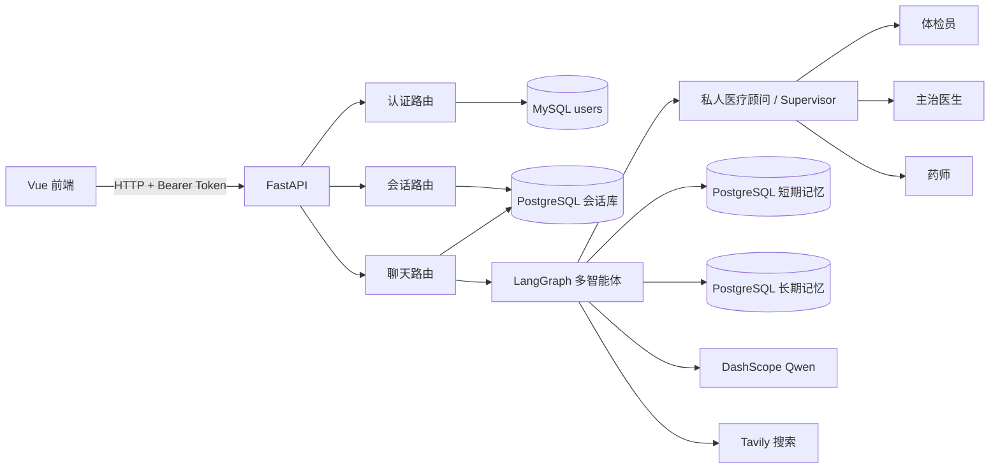
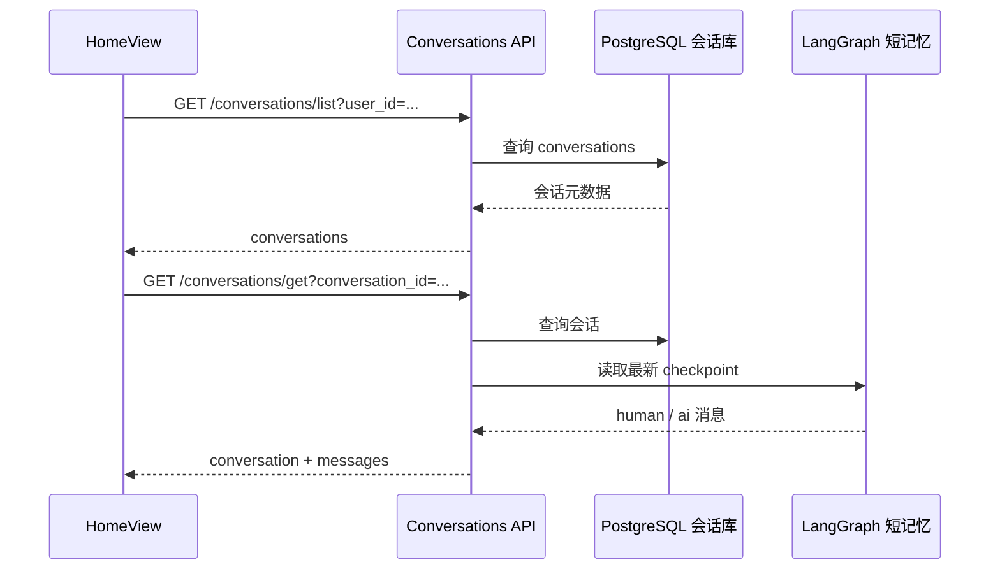
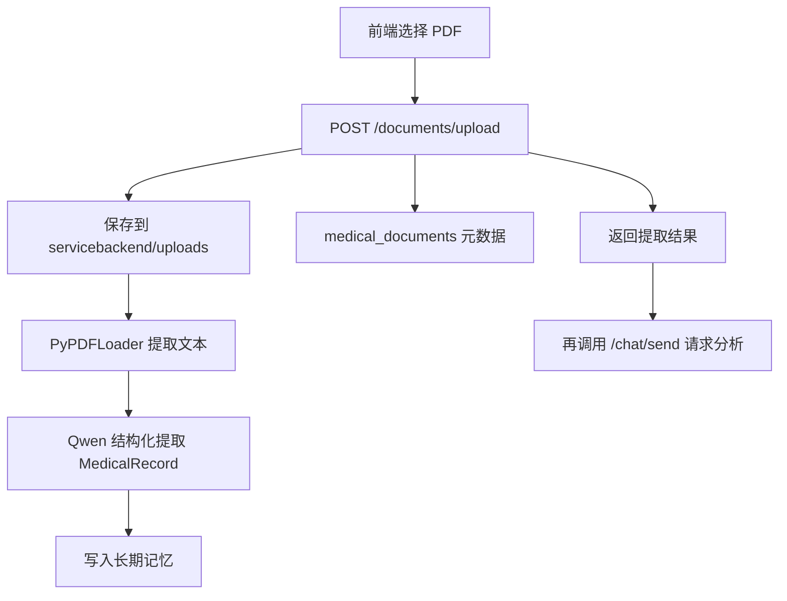
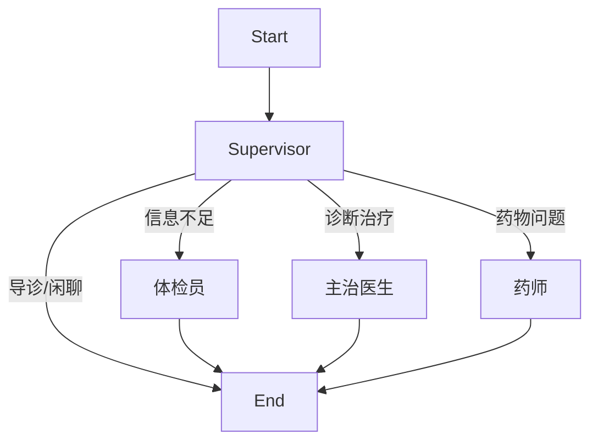

# 智能医疗助手项目熟悉指南

> 本文基于 2026-06-14 的仓库源码整理，面向第一次接手并准备继续开发本项目的维护者。建议先按第 2 节运行系统，再沿第 5 节的顺序阅读源码。

## 1. 项目概览

这是一个前后端分离的智能医疗咨询原型：

- 前端提供注册、登录、会话管理、医疗问答和 PDF 上传界面。
- 后端通过 FastAPI 提供认证、会话和聊天接口。
- 聊天核心使用 LangGraph 组织四个医疗角色，由 Supervisor 决定当前问题交给哪个角色。
- MySQL 保存用户账号。
- PostgreSQL 分别承担会话元数据、短期对话记忆和长期用户记忆。
- 大模型使用阿里云百炼兼容接口中的 `qwen3.5-plus`。
- Tavily 用于联网搜索，LangSmith 用于链路追踪。

### 1.1 当前已接通的主流程

1. 用户注册和登录。
2. 登录后创建、查询、切换和删除会话。
3. 向 `/chat/send` 发送医疗问题。
4. Supervisor 根据问题和长期记忆选择体检员、主治医生、药师或自己回复。
5. LangGraph 将会话状态保存到 PostgreSQL 短期记忆。

### 1.2 当前未完全接通的功能

- PDF 上传后端代码已经存在，但 `main.py` 没有注册该路由。
- 前端会调用 `/preferences/*`，后端当前没有偏好设置路由。
- `AboutView.vue` 和 `PreferencesView.vue` 已存在，但前端路由表没有注册对应路径。
- 项目名称和依赖中提到 RAG/Chroma，但当前源码只实现 PDF 信息提取并写入长期记忆，没有看到已接通的向量检索链。

### 1.3 技术栈

| 层级 | 主要技术 |
| --- | --- |
| 前端 | Vue 3、TypeScript、Vite、Element Plus、Vue Router、Pinia、Axios、Marked |
| Web API | FastAPI、Uvicorn、Pydantic |
| 智能体 | LangChain 1.x、LangGraph 1.x、LangChain Agent |
| 模型 | DashScope 兼容 OpenAI API、`qwen3.5-plus` |
| 联网工具 | Tavily |
| 用户数据库 | MySQL、SQLAlchemy |
| 会话数据库 | PostgreSQL、SQLAlchemy |
| 短期记忆 | PostgreSQL、`PostgresSaver` |
| 长期记忆 | PostgreSQL、`PostgresStore` |
| 文档处理 | PyPDFLoader、LLM 结构化输出 |
| 认证 | OAuth2 Password Flow、JWT、bcrypt |

### 1.4 总体架构



## 2. 五分钟快速启动

### 2.1 本地环境

当前工作区验证到的版本：

- Python `3.12.10`
- Node.js `24.14.1`
- npm `11.11.0`

仓库中已有 `servicebackend/.venv` 和 `frontend/node_modules`，但换机器后仍建议重新安装依赖。

运行完整功能前需要准备：

- 一个 MySQL 数据库。
- 三个 PostgreSQL 数据库：短期记忆、长期记忆、会话管理。
- DashScope API Key。
- Tavily API Key。
- 可选的 LangSmith API Key。

### 2.2 启动后端

```powershell
cd E:\AprojectDmeo\AI-Medical-Assistant\servicebackend
.\.venv\Scripts\Activate.ps1
pip install -r requirements.txt
python main.py
```

如果 PowerShell 禁止执行激活脚本，可直接使用虚拟环境中的 Python：

```powershell
cd E:\AprojectDmeo\AI-Medical-Assistant\servicebackend
.\.venv\Scripts\python.exe -m pip install -r requirements.txt
.\.venv\Scripts\python.exe main.py
```

后端监听地址由 `servicebackend/.env` 中的 `HOST` 和 `PORT` 决定。前端当前默认连接 `http://localhost:8000`，因此本地开发建议使用：

```dotenv
HOST=127.0.0.1
PORT=8000
```

启动后检查：

- 根接口：`http://127.0.0.1:8000/`
- Swagger：`http://127.0.0.1:8000/docs`
- OpenAPI JSON：`http://127.0.0.1:8000/openapi.json`

### 2.3 启动前端

另开一个 PowerShell：

```powershell
cd E:\AprojectDmeo\AI-Medical-Assistant\frontend
npm install
npm run dev
```

默认访问地址：

```text
http://127.0.0.1:5173/
```

前端后端地址配置在 `frontend/.env`：

```dotenv
VITE_BACKEND_URL=http://localhost:8000
```

注意：`HomeView.vue` 使用该变量，但登录和注册页面仍硬编码 `http://localhost:8000`。

### 2.4 建议的首次体验顺序

1. 打开 `/register` 注册用户。
2. 在 `/login` 登录。
3. 首页会自动加载已有会话；没有会话时会创建新会话。
4. 发送“我头痛两天了”观察 Supervisor 路由。
5. 继续提供年龄、性别、病史，观察长期记忆效果。
6. 在 Swagger 中查看当前实际注册的 API。

## 3. 环境变量与外部依赖

### 3.1 后端变量

配置加载入口是 [`servicebackend/app/config/settings.py`](servicebackend/app/config/settings.py)。它会强制从 `servicebackend/.env` 覆盖同名系统环境变量。

| 变量 | 用途 |
| --- | --- |
| `DASHSCOPE_API_KEY` | 调用 Qwen 聊天模型和文档提取模型 |
| `TAVILY_API_KEY` | 智能体联网搜索 |
| `LANGCHAIN_TRACING_V2` | 是否开启 LangSmith 追踪 |
| `LANGCHAIN_API_KEY` | LangSmith 鉴权 |
| `LANGCHAIN_PROJECT` | LangSmith 项目名 |
| `DATABASE_URL` | MySQL 用户认证库 |
| `POSTGRES_SHORT_TERM_URL` | LangGraph checkpoint 短期记忆 |
| `POSTGRES_LONG_TERM_URL` | 用户信息和医疗历史长期记忆 |
| `POSTGRES_SESSION_URL` | 会话列表和医疗文档元数据 |
| `SECRET_KEY` | JWT 签名密钥 |
| `ALGORITHM` | JWT 算法，默认 `HS256` |
| `ACCESS_TOKEN_EXPIRE_MINUTES` | Token 有效期 |
| `HOST` | Uvicorn 监听地址，当前代码没有默认值 |
| `PORT` | Uvicorn 端口，当前代码没有默认值 |

不要把 `.env`、数据库密码或 API Key 提交到 Git。仓库根 `.gitignore` 已忽略前后端环境文件。

### 3.2 数据库职责

| 配置 | 代码入口 | 保存内容 |
| --- | --- | --- |
| `DATABASE_URL` | `app/database/mysql.py` | `users` 用户账号 |
| `POSTGRES_SESSION_URL` | `app/database/postgres.py` | `conversations`、`medical_documents` |
| `POSTGRES_SHORT_TERM_URL` | `app/agents/memory.py` | LangGraph checkpoint、完整对话状态 |
| `POSTGRES_LONG_TERM_URL` | `app/agents/memory.py` | 基本信息、病史、诊断和处方等长期记忆 |

后端导入 `main.py` 时就会构造数据库引擎，并尝试创建 MySQL 和会话 PostgreSQL 表。数据库地址缺失或不可达可能导致启动失败或功能不可用。

## 4. 目录结构

```text
AI-Medical-Assistant/
├─ frontend/
│  ├─ src/
│  │  ├─ main.ts                  # Vue 应用入口
│  │  ├─ App.vue                  # 根组件，只渲染 RouterView
│  │  ├─ router/
│  │  │  ├─ index.js              # 当前 Vite 实际解析的路由文件
│  │  │  └─ index.ts              # 重复路由实现
│  │  └─ views/
│  │     ├─ HomeView.vue          # 聊天、会话、上传主页面
│  │     ├─ LoginView.vue         # 登录
│  │     ├─ RegisterView.vue      # 注册
│  │     ├─ PreferencesView.vue   # 偏好页面，当前未注册路由
│  │     └─ AboutView.vue         # 关于页面，当前未注册路由
│  ├─ package.json
│  ├─ vite.config.ts
│  └─ .env
├─ servicebackend/
│  ├─ main.py                     # FastAPI 入口、CORS、路由注册
│  ├─ app/
│  │  ├─ api/
│  │  │  ├─ auth.py               # 注册、登录、JWT
│  │  │  ├─ chat.py               # 非流式聊天
│  │  │  ├─ conversations.py      # 会话增查删
│  │  │  └─ medical_upload.py     # PDF 上传，当前未注册
│  │  ├─ agents/
│  │  │  ├─ multi_agent.py        # LangGraph 构建入口
│  │  │  ├─ supervisor.py         # 调度和导诊
│  │  │  ├─ medical_examiner.py   # 信息收集
│  │  │  ├─ attending_doctor.py   # 诊断和治疗建议
│  │  │  ├─ pharmacist.py         # 用药指导
│  │  │  ├─ memory.py             # 长短期记忆
│  │  │  ├─ tools.py              # 搜索和记忆写入工具
│  │  │  ├─ state.py              # LangGraph 状态
│  │  │  └─ base.py               # Qwen 模型初始化
│  │  ├─ database/
│  │  │  ├─ mysql.py
│  │  │  └─ postgres.py
│  │  ├─ models/                  # SQLAlchemy 模型
│  │  ├─ schemas/                 # Pydantic 模型
│  │  ├─ rag/
│  │  │  └─ document_extractor.py # PDF 结构化信息提取
│  │  └─ config/settings.py
│  ├─ tests/
│  │  ├─ test_chat_routes.py
│  │  └─ test_conversation_routes.py
│  ├─ requirements.txt
│  └─ .env
├─ PROJECT_GUIDE.md
└─ docs/superpowers/              # 本次文档设计和执行计划
```

## 5. 推荐阅读顺序

按下面顺序阅读，可以最快建立完整调用链：

1. [`frontend/src/main.ts`](frontend/src/main.ts)：确认 Vue 插件和路由如何挂载。
2. [`frontend/src/router/index.js`](frontend/src/router/index.js)：确认实际能访问的页面。
3. [`frontend/src/views/HomeView.vue`](frontend/src/views/HomeView.vue)：找到会话、聊天和上传请求。
4. [`servicebackend/main.py`](servicebackend/main.py)：确认真正注册到 FastAPI 的路由。
5. [`servicebackend/app/api/auth.py`](servicebackend/app/api/auth.py)：理解 Token 来源。
6. [`servicebackend/app/api/conversations.py`](servicebackend/app/api/conversations.py)：理解会话元数据和短记忆读取。
7. [`servicebackend/app/api/chat.py`](servicebackend/app/api/chat.py)：从 HTTP 请求进入多智能体系统。
8. [`servicebackend/app/agents/multi_agent.py`](servicebackend/app/agents/multi_agent.py)：理解图结构。
9. `supervisor.py`、`medical_examiner.py`、`attending_doctor.py`、`pharmacist.py`：理解角色边界。
10. [`servicebackend/app/agents/memory.py`](servicebackend/app/agents/memory.py)：理解长短期记忆。
11. [`servicebackend/app/agents/tools.py`](servicebackend/app/agents/tools.py)：理解 Agent 如何搜索和写入记忆。
12. [`servicebackend/app/rag/document_extractor.py`](servicebackend/app/rag/document_extractor.py)：理解 PDF 处理现状。
13. `servicebackend/tests/`：了解当前测试覆盖边界。

## 6. 核心业务流程

### 6.1 注册与登录

注册流程：

1. `RegisterView.vue` 收集用户名、密码、邮箱。
2. 前端调用 `POST http://localhost:8000/auth/register`。
3. `auth.py` 检查用户名或邮箱是否重复。
4. bcrypt 对密码做哈希。
5. 用户保存到 MySQL `users` 表。

登录流程：

1. `LoginView.vue` 以 `application/x-www-form-urlencoded` 调用 `/auth/token`。
2. `auth.py` 查询 MySQL 用户并校验 bcrypt 密码。
3. 后端把用户 ID 写入 JWT 的 `sub` 字段。
4. 前端把 `access_token` 和用户信息写入 `localStorage`。
5. 路由守卫只检查 `localStorage` 是否存在 `token`，存在时允许访问首页。

后续受保护接口通过：

```http
Authorization: Bearer <access_token>
```

调用 `get_current_user()` 完成 JWT 解码和用户查询。

### 6.2 会话管理



会话 API 的职责：

- `/conversations/create`：在会话库创建元数据，ID 由前端生成。
- `/conversations/list`：按 `last_active` 倒序返回用户会话。
- `/conversations/get`：返回会话元数据，并从 checkpoint 读取历史消息。
- `/conversations/delete`：删除会话元数据，并尝试清理对应短期记忆线程。

需要注意：列表接口返回 `last_message`、`last_active`，但 `HomeView.vue` 的列表映射读取 `lastMessage`、`lastActive`，当前存在字段命名不一致。

### 6.3 发送医疗问题

聊天请求体：

```json
{
  "user_id": "user_1",
  "message": "我头痛两天了",
  "thread_id": "conv_xxx"
}
```

完整链路：

1. `HomeView.vue` 在本地先插入用户消息和空的助手消息。
2. 前端携带 Bearer Token 调用 `POST /chat/send`。
3. `chat.py` 根据 `thread_id` 更新会话的最后消息和活跃时间。
4. `create_medical_agent_system()` 初始化长短期记忆并编译 LangGraph。
5. Supervisor 读取对话上下文和长期记忆，通过 Qwen 判断当前应该由谁处理。
6. Supervisor 自己回复，或者路由到体检员、主治医生、药师之一。
7. 当前角色可调用 Tavily 搜索或长期记忆写入工具。
8. LangGraph 通过 `thread_id` 把状态保存到短期记忆数据库。
9. `chat.py` 从结果中反向寻找最后一条非空 `AIMessage`。
10. 后端一次性返回完整文本，前端替换空的助手消息。

重要：当前图是“一问一答、每轮一个角色”的中心辐射结构。一次请求不会自动依次执行“体检员 -> 主治医生 -> 药师”；后续用户消息会再次进入 Supervisor，由历史上下文决定下一角色。

### 6.4 上传医疗文档

代码设计的目标流程：



实际情况：

- 前端调用路径是 `/documents/upload`。
- 后端上传函数位于 `app/api/medical_upload.py`。
- `main.py` 没有 `include_router()` 注册该文件，因此当前请求会返回 404。
- 如果完成路由注册，上传逻辑会保存 PDF、提取最多前 8000 个字符、调用 Qwen 生成 `MedicalRecord`，再写入长期记忆和 `medical_documents` 表。

## 7. 前端源码导读

### 7.1 应用入口

[`frontend/src/main.ts`](frontend/src/main.ts) 完成：

- 创建 Vue 应用。
- 注册 Pinia、Vue Router、Element Plus。
- 全局注册 Element Plus 图标。
- 挂载到 `#app`。

项目虽然注册了 Pinia，但当前没有 `stores/` 目录，页面状态主要放在组件内和 `localStorage`。

### 7.2 路由

`main.ts` 使用无扩展名的 `import router from './router'`。通过 Vite 解析验证，当前实际加载：

```text
frontend/src/router/index.js
```

当前可访问路由：

| 路径 | 页面 | 是否要求 Token |
| --- | --- | --- |
| `/` | `HomeView.vue` | 是 |
| `/login` | `LoginView.vue` | 否 |
| `/register` | `RegisterView.vue` | 否 |
| 其他路径 | 重定向 `/login` | - |

`AboutView.vue` 和 `PreferencesView.vue` 当前不在路由表中。`index.js` 与 `index.ts` 内容接近但重复存在，后续应保留一个明确入口。

### 7.3 首页

[`frontend/src/views/HomeView.vue`](frontend/src/views/HomeView.vue) 同时负责：

- 登录状态检查。
- 会话加载、创建、切换和删除。
- 消息输入和发送。
- Markdown 渲染。
- PDF 上传和进度遮罩。
- 偏好指令识别。
- 历史消息读取。
- 页面全部布局与样式。

这是当前前端最重要、也最需要后续拆分的文件。

主要响应式状态：

| 状态 | 用途 |
| --- | --- |
| `messages` | 当前会话消息 |
| `inputMessage` | 输入框 |
| `user` / `userId` | 登录用户与 Agent 用户标识 |
| `threadId` | LangGraph 线程 ID |
| `conversations` | 左侧会话列表 |
| `currentConversation` | 当前会话 ID |
| `isUploading` / `uploadProgress` | 上传遮罩 |

### 7.4 登录和注册

`LoginView.vue` 和 `RegisterView.vue`：

- 使用 Element Plus 表单验证。
- 直接调用硬编码的 `http://localhost:8000`。
- 登录成功后写入 `localStorage.token` 和 `localStorage.user`。

建议后续统一使用一个 Axios 实例和 `VITE_BACKEND_URL`。

### 7.5 Markdown 显示

AI 回复通过 `marked()` 转成 HTML，再使用 `v-html` 渲染。当前没有 HTML 清洗步骤。如果模型输出或历史消息包含恶意 HTML，可能造成 XSS。生产化前应接入 DOMPurify 等白名单清洗。

## 8. 后端 API 与认证

### 8.1 FastAPI 入口

[`servicebackend/main.py`](servicebackend/main.py) 负责：

- 设置 LangSmith 环境变量。
- 创建 MySQL 和会话 PostgreSQL 表。
- 创建 FastAPI 应用。
- 配置 CORS。
- 注册认证、聊天和会话路由。
- 启动 Uvicorn。

当前 CORS 使用：

```python
allow_origins=["*"]
allow_credentials=True
```

开发阶段方便，但生产环境应改为明确的前端域名。

### 8.2 认证

[`servicebackend/app/api/auth.py`](servicebackend/app/api/auth.py) 使用：

- OAuth2 Password Flow 接收用户名和密码。
- bcrypt 保存和验证密码哈希。
- JWT 保存用户 ID。
- `get_current_user()` 保护聊天和会话接口。

Token 本身只证明“用户已登录”。会话和聊天接口仍需补充资源归属校验，确保请求中的 `user_id`、`thread_id` 属于当前 Token 用户。

### 8.3 聊天 API

[`servicebackend/app/api/chat.py`](servicebackend/app/api/chat.py) 是前端进入智能体系统的唯一入口。它目前是非流式 API，必须等完整 Agent 执行结束才返回。

发生错误时：

- 没有有效 AI 文本：返回 500。
- Agent 执行失败：返回 500，并把异常字符串放入响应详情。
- 前端把空助手消息替换为重试提示。

## 9. 多智能体系统

### 9.1 图结构

[`servicebackend/app/agents/multi_agent.py`](servicebackend/app/agents/multi_agent.py) 构建以下图：



### 9.2 角色职责

| 节点 | 文件 | 主要职责 | 可用工具 |
| --- | --- | --- | --- |
| Supervisor | `supervisor.py` | 路由、问候、导诊 | `search_web` |
| 体检员 | `medical_examiner.py` | 收集基本信息、症状、病史 | 搜索、保存基本信息、保存医疗信息 |
| 主治医生 | `attending_doctor.py` | 诊断、治疗方案、用药建议 | 搜索、保存医疗信息 |
| 药师 | `pharmacist.py` | 用药方法、副作用、相互作用、替代方案 | 搜索、保存医疗信息 |

### 9.3 共享状态

`MedicalAgentState` 主要字段：

- `messages`：通过 `add_messages` 自动累积。
- `user_id`：长期记忆命名空间。
- `thread_id`：短期记忆线程。
- `medical_documents`：预留文档列表。
- `diagnosis`：主治医生结果。
- `prescription`：药师结果。
- `next`：Supervisor 的路由结果。

### 9.4 模型和工具

`base.py` 每次调用 `get_model()` 都创建一个 `ChatOpenAI` 客户端：

```text
model: qwen3.5-plus
base_url: https://dashscope.aliyuncs.com/compatible-mode/v1
temperature: 0.3
```

`tools.py` 提供：

- `search_web`：Tavily 最多返回 3 条结果。
- `save_user_info`：按字段覆盖长期基本信息。
- `save_medical_info`：使用随机 ID 追加症状、过敏史等记录。

## 10. 数据库与记忆

### 10.1 用户账号

MySQL `users` 表保存：

- `id`
- `username`
- `email`
- `password_hash`
- `created_at`
- `updated_at`

### 10.2 会话元数据

PostgreSQL `conversations` 表保存：

- 会话 ID
- MySQL 用户整数 ID
- 标题
- 最后一条消息摘要
- 最后活跃时间
- 创建时间

它只保存会话列表需要的元数据，完整消息来自短期记忆 checkpoint。

### 10.3 短期记忆

`PostgresSaver` 使用 `thread_id` 隔离会话。每次 Graph 调用都会读取和写入 checkpoint，因此下一轮请求能够看到之前的消息。

### 10.4 长期记忆

`PostgresStore` 使用 namespace 分类：

| Namespace | 内容 |
| --- | --- |
| `("user_preferences", user_id)` | 姓名、年龄、性别、联系方式等 |
| `("user_medical_history", user_id)` | 症状、过敏史、既往病史等 |
| `("user_medical_records", user_id, "diagnosis")` | 主治医生诊断 |
| `("user_medical_records", user_id, "prescription")` | 药师处方和指导 |

当前 `get_user_long_memory()` 实际只读取前两类；诊断和处方虽被写入 `user_medical_records`，但对应读取代码被注释掉，因此它们不会自动出现在后续角色的长期记忆摘要中。

### 10.5 用户 ID 的两种形式

- 认证和会话库使用 MySQL 整数 ID，例如 `3`。
- Agent 长期记忆使用前端拼接的字符串，例如 `user_3`。

修改接口时需要保持这两种标识的转换一致。

## 11. RAG 文档处理

目录名是 `rag/`，依赖中也包含 Chroma，但当前实现更准确地说是“PDF 结构化信息提取”：

1. `PyPDFLoader` 读取 PDF。
2. 合并所有页面文本。
3. 只把前 8000 个字符发送给 Qwen。
4. Qwen 按 `MedicalRecord` 输出基本信息、症状、病史、过敏史、诊断等。
5. 基本信息写入 `user_preferences`。
6. 医疗信息写入 `user_medical_history`。

当前源码没有发现：

- 文档切块。
- Embedding 生成。
- Chroma 向量写入。
- 相似度检索。
- 检索结果注入聊天提示词。

因此不要把当前功能理解为完整 RAG。要实现医疗文档检索问答，需要新增索引和 Retriever 链路。

## 12. API 速查表

### 12.1 当前已注册接口

| 方法 | 路径 | 鉴权 | 主要输入 | 主要输出 |
| --- | --- | --- | --- | --- |
| GET | `/` | 否 | 无 | 服务信息 |
| POST | `/auth/register` | 否 | JSON：用户名、邮箱、密码 | 用户信息 |
| POST | `/auth/token` | 否 | Form：用户名、密码 | JWT、用户 ID |
| POST | `/chat/send` | 是 | JSON：`user_id`、`message`、`thread_id` | `success`、AI 文本 |
| POST | `/conversations/create` | 是 | Query：`user_id`；JSON：ID、标题 | 新会话 |
| GET | `/conversations/list` | 是 | Query：`user_id` | 会话列表 |
| GET | `/conversations/get` | 是 | Query：`conversation_id` | 会话和消息 |
| DELETE | `/conversations/delete` | 是 | Query：`conversation_id` | 删除结果 |

### 12.2 已有代码但未注册

| 预期方法 | 预期路径 | 状态 |
| --- | --- | --- |
| POST | `/documents/upload` | `medical_upload.py` 已实现，`main.py` 未注册 |
| GET/POST | `/preferences/*` | 前端有调用，后端没有对应路由文件 |

### 12.3 示例：登录

```powershell
$form = @{
  username = 'demo'
  password = 'your-password'
}

$login = Invoke-RestMethod `
  -Method Post `
  -Uri 'http://127.0.0.1:8000/auth/token' `
  -ContentType 'application/x-www-form-urlencoded' `
  -Body $form
```

### 12.4 示例：聊天

```powershell
$headers = @{
  Authorization = "Bearer $($login.access_token)"
}

$body = @{
  user_id = "user_$($login.user_id)"
  message = '我头痛两天了'
  thread_id = 'conv_demo'
} | ConvertTo-Json

Invoke-RestMethod `
  -Method Post `
  -Uri 'http://127.0.0.1:8000/chat/send' `
  -Headers $headers `
  -ContentType 'application/json' `
  -Body $body
```

聊天前通常需要先调用 `/conversations/create` 创建对应 `thread_id`。

## 13. 测试与调试

### 13.1 前端

构建：

```powershell
cd E:\AprojectDmeo\AI-Medical-Assistant\frontend
npm run build
```

代码检查：

```powershell
npm run lint
```

当前仓库执行该命令会在加载 `eslint.config.ts` 时失败，ESLint 提示缺少 `jiti`。需要把 `jiti` 加入开发依赖，或把 ESLint 配置改为当前运行环境可直接加载的格式后，才能把 lint 作为有效的质量门禁。

项目安装了 Vitest，但 `package.json` 没有 `test` 脚本，`src` 中也没有现成测试文件。

当前构建脚本是：

```text
tsc && vite build
```

它没有使用常见的 `vue-tsc` 对 `.vue` 单文件组件做完整类型检查，所以构建成功不代表组件脚本没有 TypeScript 问题。

### 13.2 后端

```powershell
cd E:\AprojectDmeo\AI-Medical-Assistant\servicebackend
.\.venv\Scripts\python.exe -m unittest discover -s tests -v
```

当前测试覆盖：

- `/chat/send` 路由存在。
- 聊天接口能从多条 AI 消息中返回最后一条非空消息。
- 会话创建和列表路由存在。

在 2026-06-14 的当前环境中，后端测试结果为 `4/4` 通过；前端 `npm run build` 成功，但有构建产物超过 500 kB 的警告。

没有覆盖：

- 真实数据库读写。
- JWT 完整流程。
- 资源归属授权。
- 四个 Agent 的路由准确性。
- 长短期记忆持久化。
- PDF 上传和提取。
- 前端交互。

### 13.3 调试入口

- API 参数问题：先看 `/docs`。
- Agent 路由问题：看终端中的 `[路由决策]`。
- 记忆问题：看 `初始化短记忆`、`初始化长记忆` 和保存日志。
- 模型调用问题：查看 DashScope 错误和 LangSmith trace。
- 会话历史问题：从 `conversations.get_conversation()` 的 checkpoint 读取逻辑开始。

## 14. 当前实现注意事项

以下问题按“先影响主流程、再影响维护性”的顺序排列。

### 14.1 文档上传没有注册

`medical_upload.py` 存在，但 `main.py` 没有：

```python
app.include_router(..., prefix="/documents")
```

前端上传会返回 404。

### 14.2 偏好接口不存在

前端调用：

- `/preferences/list`
- `/preferences/save`
- `/preferences/get_medical_history`

后端没有对应路由。相关操作会失败。

### 14.3 会话列表字段命名不一致

后端返回：

```text
last_message
last_active
```

前端列表映射读取：

```text
lastMessage
lastActive
```

这会导致最后消息为空、时间无效。应在 API 层统一 DTO，或在前端显式映射。

### 14.4 已有页面没有路由

`AboutView.vue` 和 `PreferencesView.vue` 中有导航链接，但 `/about`、`/preferences` 会被通配路由重定向到 `/login`。

### 14.5 路由文件重复

`router/index.js` 和 `router/index.ts` 同时存在。Vite 当前解析 `index.js`，修改 `index.ts` 不会影响运行结果。

### 14.6 API 地址没有统一

- 首页使用 `VITE_BACKEND_URL`。
- 登录和注册硬编码 `http://localhost:8000`。

部署到其他域名时容易出现部分页面可用、部分页面失败。

### 14.7 授权只验证登录，没有验证资源归属

会话接口接受任意 `user_id` 或 `conversation_id`，聊天接口接受任意 `user_id` 和 `thread_id`，但没有统一检查它们是否属于 `current_user`。生产环境必须补齐对象级授权。

### 14.8 `HomeView.vue` 职责过多

文件同时承担 API、业务状态、Markdown、上传和全部样式，并保留多段未使用代码，例如打字机效果、空保存函数和未调用历史加载函数。

上传失败分支还引用了 `try` 块内部定义的 `progressInterval`，异常路径可能再次抛出作用域错误。

### 14.9 AI HTML 未清洗

`marked` 输出直接传给 `v-html`，存在 XSS 风险。

### 14.10 后端启动强依赖外部配置

- `HOST`、`PORT` 没有默认值。
- 数据库引擎在模块导入阶段创建。
- `main.py` 的 PostgreSQL 失败提示引用了仓库中不存在的 `init_postgres.sql`，并包含硬编码地址。

### 14.11 长期记忆读写不完全对称

主治医生和药师把结果写入 `user_medical_records`，但长期记忆读取函数没有启用这些 namespace 的读取逻辑。

### 14.12 当前不是完整 RAG

Chroma 相关依赖存在，但没有向量索引和检索代码。文档和产品描述应与实际能力一致。

### 14.13 测试覆盖有限

现有测试偏向路由冒烟测试，无法保护数据库、Agent、记忆、权限和前端流程。

### 14.14 医疗安全和合规

当前提示词允许主治医生给出诊断和药物处方。产品化前至少需要：

- 明确“辅助信息，不替代医生诊疗”。
- 对急症和高风险症状建立强制线下就医规则。
- 对剂量、孕妇、儿童、肝肾功能和药物相互作用做结构化校验。
- 对医疗数据的存储、访问、日志和删除建立合规策略。
- 避免把内部异常、密钥或个人敏感信息返回给前端。

## 15. 后续开发建议

### 第一阶段：打通现有功能

1. 注册 `/documents/upload`，或暂时从前端移除上传入口。
2. 实现偏好 API，或删除尚未实现的偏好调用。
3. 修正会话列表字段映射。
4. 注册 `/about` 和 `/preferences`，或删除未使用页面。
5. 删除重复路由文件，只保留 TypeScript 版本。
6. 统一 Axios 客户端、API Base URL 和 Token 注入。

### 第二阶段：安全与数据一致性

1. 所有会话查询增加 `Conversation.user_id == current_user.id`。
2. 后端根据 Token 生成 Agent `user_id`，不信任前端传入值。
3. 上传文件校验 MIME、大小和安全文件名。
4. 清洗 Markdown HTML。
5. 缩小 CORS 范围。
6. 统一错误响应，不向客户端暴露内部异常。

### 第三阶段：拆分和测试

1. 把 `HomeView.vue` 拆成会话侧栏、消息列表、输入区和上传组件。
2. 提取 `api/` 客户端和组合式函数。
3. 将前端构建切换到 `vue-tsc`。
4. 增加认证、会话归属、Agent 路由、记忆和上传测试。
5. 使用临时数据库或容器做集成测试。

### 第四阶段：补齐真正的 RAG

1. PDF 文本切块。
2. 生成 Embedding。
3. 写入 Chroma 或其他向量库。
4. 按用户和文档做 metadata 隔离。
5. 在医疗问答前检索相关片段。
6. 返回引用来源和页码。

## 16. 快速排障

### 后端启动时报数据库错误

检查：

1. `.env` 中四个数据库 URL 是否完整。
2. MySQL 和 PostgreSQL 服务是否可连接。
3. PostgreSQL 三个目标数据库是否已创建。
4. 当前 IP 是否被数据库防火墙允许。

### 后端启动时报 `PORT` 转换错误

`settings.py` 直接执行 `int(os.getenv("PORT"))`。确认 `.env` 中存在有效整数：

```dotenv
PORT=8000
```

### 页面总是跳转登录

路由守卫只检查：

```text
localStorage.token
```

确认登录响应成功并已写入 Token。Token 过期时前端不会主动刷新，需要重新登录。

### 接口返回 401

确认请求头包含：

```http
Authorization: Bearer <token>
```

并确认 MySQL 中仍存在 Token 对应的用户。

### 会话列表消息或时间不显示

优先检查第 14.3 节的 `snake_case`/`camelCase` 字段映射问题。

### 文档上传返回 404

这是当前预期问题：上传路由尚未在 `main.py` 注册。

### 偏好设置返回 404

这是当前预期问题：后端没有 `/preferences/*` 路由。

### 聊天返回 500

依次检查：

1. DashScope Key 和模型权限。
2. 短期、长期 PostgreSQL 是否可连接。
3. `thread_id` 对应会话是否存在。
4. LangSmith 或终端中的 Agent 异常。
5. Qwen 是否返回了非空 `AIMessage`。

### 前端构建成功但页面运行报错

当前 `npm run build` 没有对 `.vue` 脚本做完整 `vue-tsc` 检查。查看浏览器控制台，并重点检查 `HomeView.vue` 的异常分支和未定义变量。

### `npm run lint` 提示缺少 `jiti`

当前 ESLint 使用 TypeScript 配置文件 `eslint.config.ts`。安装兼容版本的 `jiti` 开发依赖，或调整 ESLint 配置加载方式后重试。

---

掌握本项目最关键的主线是：

```text
HomeView
  -> /chat/send
  -> create_medical_agent_system
  -> Supervisor 选择一个角色
  -> PostgreSQL 长短期记忆
  -> 返回最后一条非空 AI 消息
```

先把这条链路跑通，再处理上传、偏好、真正的 RAG 和工程拆分，效率最高。
